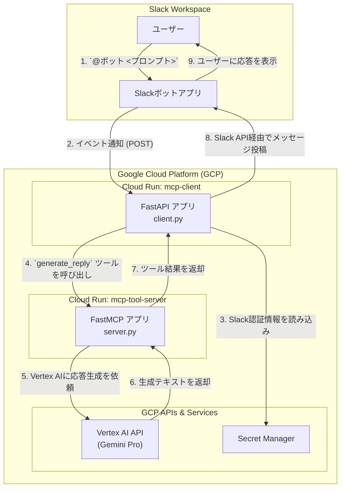

# MCP on Cloud Run (Slack Bot Sample)

このプロジェクトは、`fastmcp`フレームワークを利用して構築されたAI搭載Slackボットのサンプルです。Google Cloud Run上で動作するバックエンドのツールサーバーと、Slackからのイベントを処理するクライアントで構成されています。

## アーキテクチャ

このシステムは、ユーザーからのSlackメンションをトリガーとして、Cloud Run上で動作するクライアント(`mcp-client`)にリクエストを送信します。クライアントは、もう一方のCloud Runサービス(`mcp-tool-server`)に処理を依頼します。サーバーはGoogle Vertex AI (Gemini Pro) を利用して応答を生成し、その結果をクライアント経由でSlackに返します。

認証情報などの機密情報は、Google Secret Managerで安全に管理されます。



## 事前準備

デプロイを開始する前に、以下の準備が必要です。

1.  **Google Cloud SDK (`gcloud`)**: [インストール](https://cloud.google.com/sdk/docs/install)し、初期化しておきます。
    ```bash
    gcloud init
    ```
2.  **GCPプロジェクト**: 課金が有効になっているGCPプロジェクト。
3.  **Slackアプリ**: SlackワークスペースにインストールされたカスタムSlackアプリ。

## セットアップとデプロイ手順

### 1. GCPプロジェクトの設定

ターミナルで、使用するGCPプロジェクトIDを設定し、必要なAPIを有効化します。

```bash
# YOUR_GCP_PROJECT_ID をご自身のプロジェクトIDに置き換えてください
export GCP_PROJECT_ID="YOUR_GCP_PROJECT_ID"
gcloud config set project $GCP_PROJECT_ID

# 必要なGCPサービスAPIを有効化
gcloud services enable \
  run.googleapis.com \
  artifactregistry.googleapis.com \
  cloudbuild.googleapis.com \
  aiplatform.googleapis.com \
  secretmanager.googleapis.com
```

### 2. Artifact Registryリポジトリの作成

コンテナイメージを保存するためのDockerリポジトリを作成します。

```bash
# リージョンは任意ですが、ここでは asia-northeast1 を使用します
gcloud artifacts repositories create docker-repo \
  --repository-format=docker \
  --location=asia-northeast1 \
  --description="Docker repository for MCP sample"
```

### 3. `mcp-tool-server` のデプロイ

AI応答を生成するバックエンドサーバーをデプロイします。

1.  **サービスアカウントの作成と権限付与**:
    Cloud RunがVertex AIと連携するためのサービスアカウントを作成します。
    ```bash
    export SERVICE_ACCOUNT_NAME="mcp-sa"
    export SERVICE_ACCOUNT_EMAIL="${SERVICE_ACCOUNT_NAME}@${GCP_PROJECT_ID}.iam.gserviceaccount.com"

    gcloud iam service-accounts create $SERVICE_ACCOUNT_NAME \
      --display-name="MCP Service Account"

    # Vertex AI ユーザー権限を付与
    gcloud projects add-iam-policy-binding $GCP_PROJECT_ID \
      --member="serviceAccount:${SERVICE_ACCOUNT_EMAIL}" \
      --role="roles/aiplatform.user"
    ```

2.  **ビルドとデプロイ**:
    ```bash
    cd mcp-tool-server

    # Cloud Buildでコンテナをビルドし、Artifact Registryにプッシュ
    gcloud builds submit --tag asia-northeast1-docker.pkg.dev/$GCP_PROJECT_ID/docker-repo/mcp-tool-server

    # Cloud Runにデプロイ
    gcloud run deploy mcp-tool-server \
      --image asia-northeast1-docker.pkg.dev/$GCP_PROJECT_ID/docker-repo/mcp-tool-server \
      --set-env-vars="GCP_PROJECT=$GCP_PROJECT_ID" \
      --service-account=$SERVICE_ACCOUNT_EMAIL \
      --region asia-northeast1 \
      --allow-unauthenticated
    
    cd ..
    ```
    デプロイが完了したら、表示される **サービスURL** をメモしておきます。これが`mcp-client`から呼び出すサーバーのURLになります。

### 4. Slackアプリの認証情報をSecret Managerに保存

Slackボットクライアントが必要とする機密情報を安全に保管します。

1.  **Slackアプリ情報の取得**:
    - [Slack APIの管理ページ](https://api.slack.com/apps)であなたのアプリを選択します。
    - 「**Basic Information**」ページの「App Credentials」セクションから `Signing Secret` をコピーします。
    - 「**OAuth & Permissions**」ページの「OAuth Tokens for Your Workspace」セクションから `Bot User OAuth Token` (`xoxb-...`で始まる)をコピーします。

2.  **シークレットの作成**:
    ```bash
    # YOUR_SLACK_BOT_TOKEN と YOUR_SLACK_SIGNING_SECRET を上記で取得した値に置き換えます
    echo -n "YOUR_SLACK_BOT_TOKEN" | gcloud secrets create slack-bot-token --data-file=- --replication-policy="automatic"
    echo -n "YOUR_SLACK_SIGNING_SECRET" | gcloud secrets create slack-signing-secret --data-file=- --replication-policy="automatic"

    # サービスアカウントにシークレットへのアクセス権を付与
    gcloud secrets add-iam-policy-binding slack-bot-token \
      --member="serviceAccount:${SERVICE_ACCOUNT_EMAIL}" \
      --role="roles/secretmanager.secretAccessor"
    gcloud secrets add-iam-policy-binding slack-signing-secret \
      --member="serviceAccount:${SERVICE_ACCOUNT_EMAIL}" \
      --role="roles/secretmanager.secretAccessor"
    ```

### 5. `mcp-client` のデプロイ

Slackからのイベントを処理するクライアントをデプロイします。

1.  **ビルドとデプロイ**:
    `YOUR_MCP_SERVER_URL`は、ステップ3でメモした`mcp-tool-server`のURLに置き換えてください。
    ```bash
    cd mcp-client

    # Cloud Buildでコンテナをビルド
    gcloud builds submit --tag asia-northeast1-docker.pkg.dev/$GCP_PROJECT_ID/docker-repo/mcp-client

    # Cloud Runにデプロイ
    gcloud run deploy mcp-client \
      --image asia-northeast1-docker.pkg.dev/$GCP_PROJECT_ID/docker-repo/mcp-client \
      --set-env-vars="MCP_SERVER_URL=YOUR_MCP_SERVER_URL" \
      --set-secrets="SLACK_BOT_TOKEN=slack-bot-token:latest,SLACK_SIGNING_SECRET=slack-signing-secret:latest" \
      --service-account=$SERVICE_ACCOUNT_EMAIL \
      --region asia-northeast1 \
      --allow-unauthenticated
    
    cd ..
    ```
    デプロイが完了したら、`mcp-client`の**サービスURL**をコピーします。

### 6. Slackアプリの設定完了

最後に、Slackがイベントを送信する先として、デプロイしたクライアントのURLを設定します。

1.  **Event Subscriptionsの設定**:
    - [Slack APIの管理ページ](https://api.slack.com/apps)であなたのアプリを選択します。
    - 左メニューの「**Event Subscriptions**」を開き、機能を`On`にします。
    - 「**Request URL**」に、`mcp-client`のサービスURLの末尾に`/slack/events`を追加したものを入力します。
      例: `https://mcp-client-xxxxxxxx-an.a.run.app/slack/events`
    - URLが正しく検証され、「Verified」と表示されることを確認します。

2.  **ボットイベントの購読**:
    - 「**Subscribe to bot events**」セクションで、「Add Bot User Event」をクリックし、`app_mention`イベントを追加します。

3.  **権限の再インストール**:
    - 必要に応じて、「**OAuth & Permissions**」ページに移動し、ワークスペースにアプリを再インストールします。

## ボットの使い方

1.  Slackでボットを招待したいチャンネルを開きます。
2.  メッセージ入力欄に `/invite @ボット名` と入力して、ボットを招待します。
3.  `@ボット名 <メッセージ>` の形式でメンションを付けて話しかけると、ボットが応答します。 